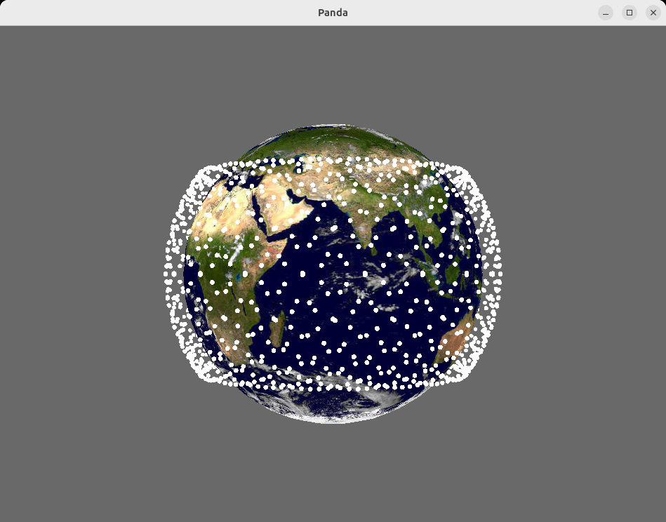
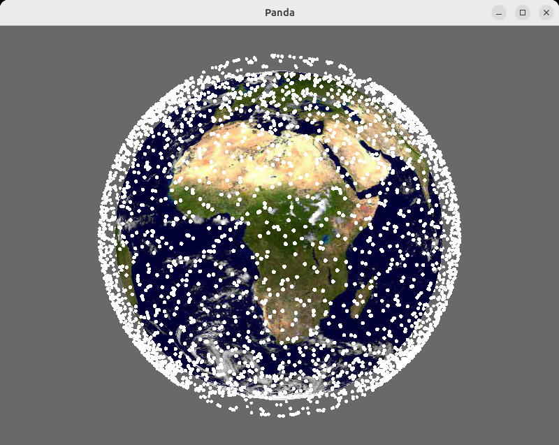

# Satellites
Scripts and programs for visualizing and modeling satellite orbits and
simulating satellite networks.

We use Panda3D to run an interactive 3D view of satellites oribiting around the 
earth, and use the Skyfield astronomy library to determin the position of
the satellites.

# Setup

For the basic set of scripts, we use Panda#D, networkx, and skyfield.

To run these, create and activate a Python virtual environment and use 
pip to install the dependencies.  In the base directory:

```
python3 -m venv venv
. venv/bin/activate
pip install -r requirements.txt
```

# Animate Ideal Orbits
We use Panda3d elements to simulate the orbits of a satellite 
network by creating 40 rotating disks inclined at 53 degrees and 
attaching spheres to the disks represent satellites.

Run an animation of a 40x40 LEO satellite conselation:

```
python animate_orbits.py
```

- Enter q to quit.
- Use arrow keys to change the view



# Calculate Actual Satellite Positions
We use the Skyfield astronomy library to calcualte the position of
earth satellites.


# Animate Real Satellite Groups
Use TLE files to position and update groups of Satellites in real time:

```
python orbit_set.py [ system [ time-factor] ]
```

The available systems are:
- starlink
- stations (space stations)
- kuiper
- GPS
- artificial (a 40x40 system)

The time-rate defaults to 2X real time, and depending on the number of 
satellites in the system and the speed of the computer and GPU running the
software, may be able to run at 10X real time.

You can control the image display:
- + and - top zoom in and out (shift + does not yet work)
- arrow keys to change the orientation of the world
- q to quit



# Network Topology and Routes
Build a topology and routing tables
```
python network.py

```

# Satellite Positions
Generate satellite positions with Skyfield and CTSC
```
python sat_pos_samples.py
```

# Network Topology
Utilities to explore a possible network topology of a satellite network where each
satellite is a router with 4 ports connecting to neighboring satellites in a torus 
topology.

- torus_topo: Generate a networkx graph of a connected set of rings (default 40x40)
- frr_config_topo: Generate FRR network configurations for a networkx topology
- test_large_frr: Generate, configure, and exercise a large torus topology

Exercise a large torus topology, generate routes, and trace paths:
```
python torus_topo.py
```

Exercise FRR network configuration generation on a small network:
```
python frr_config_topo.py
```

Generate a large torus topology and generate FRR network config information
```
python test_large_frr.py
```


# Mininet Emulation
Run an mininet based emulation of an FRR based network toplogy.

This setup contains two parts:
- A mininet process that creates network containers and launches FRR processes.
- A physical simulator process that calculates satellite positions and link states.

The network emulation uses a FastAPI based interface for control and monitoring and
provides a FastAPI user interface. 

Connect to http://localhost:8000 for the UI.
(Substitute name / IP address of VM instance if using a VM and web browser is outside of the VM)

## Setup
Running the full emulation requires Mininet and FRR to be installed as well as the requirements
listed in mnet/requriements.txt

```
pip install -r mnet/requirements.txt
```

Since mininet must run as root, it is recommended that you run the full emulation in a VM.
See [mininet_frr](http://github.com/jmwanderer/mininet_frr) for an environment that will run
the full emulation.

## Run Full Emulation

By default the simulation runs with a 4 ring by 4 satellite per ring configuration.
You can run a larger config by specifying the number of rings and nodes per
ring on the run_mn and geosimsat command links. Obviously these should be
the same.

Run the mininet environment:
```
sudo python -m mnet.run_mn mnet/configs/small.net
```

Run the satellite location simulation:
```
python geosimsat.py mnet/configs/small.net
```

## Run the UI / Sim Stub

For development and test, the FastAPI driver and network physical simulator
can be run without running mininet and the FRR processes. The mininet python libraries
are needed, but FRR does not need to be installed.
Running the stub:
- is much more light weight
- does not run as root
- is easy and safe to run without using a VM
- does not require FRR to be installed
- will not need Mininet to be installed

Running the stub simulates that satellite positions and physical events, 
provides the UI, but does not emulate the network.

```
sudo python -m mnet.run_mn mnet/configs/small.net --no-mnet
```


## TODO / Plans

The network currently runs an OSPF, staticd, and zebra daemon on each node to exchange.
Possible plans include:
- Add a flat world map and chart the positions of the satellites
- Add ground stations at fixed positions
    - Create and support a node type: SAT or GROUND
    - Initially make ground a mininet host.
- Create links between ground stations and nearby satellites
- Satellites to inject OSPF route for connected ground station
- Ground station sets and updates default routes to preferred uplink

- Adding hosts to connect as staellites move overhead
- Adding an OF controller to handle host connectivity (at some point)
- Using an agent on host and satellites for control and connectivity testing


# Useful Information

- [Skyfield Library](https://rhodesmill.org/skyfield/earth-satellites.html)
- [Network topology design at 27,000 km.hour](https://satnetwork.github.io)
- [Celes Track Satellite Catalog](https://celestrak.org/satcat/search.php)
- [NetworkX](https://networkx.org/documentation/stable/index.html)
- [draft-li-arch-sat-04][https://datatracker.ietf.org/doc/html/draft-li-arch-sat-04]

