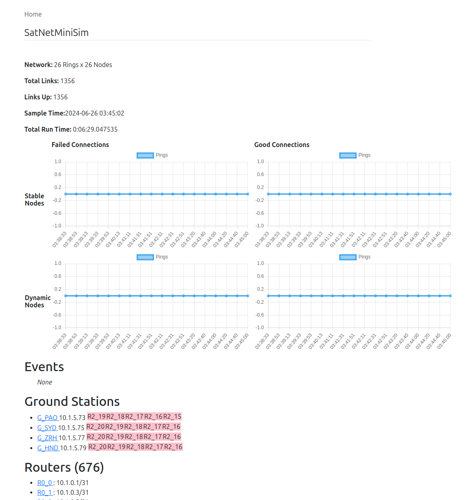

# Mininet Satellite Emulation

This module contains the code with dependencies on mininet. These should be run in a VM with both Mininet and FR Routing installed.

## Running Tests

From the root directory of the project:

```
PYTHONPATH=. python3 -m unittest mnet/tests.py
```

## Configuration Files

The parameters for specific networks are set in configuration files in mnet/configs
The following parameters can be set:
- rings: number of orbital rings
- routers: number of satellites per orbit
- ground_stations: include ground stations in the network
- minimum_altitude: the number of degrees above the horizon necessary to connect to satellties
- stable_monitors: run monitoring from stable (expected reachable) nodes

The format is:

```
[network]
rings=20
routers=20
ground_stations=yes

[physical]
minimim_altitude=25

[monitor]
stable_monitors=No
```

## Reporting



### Connections
Node to node monitoring is done with pings. The point to point ping results
are reported as success and failure counts. We only consider a ping as failed 
after the point to point ping has successed at least once. This eliminates
the large number of failures that would be reported on startup

The point to point connections are separated into those nodes that are
expected to always be reachable, and those that might not be reachable.
Satellites should always be reachable from other satellites and are
reported as stable noides. However ground stations may not have an uplink
at times, and are reported as dynamic

#### Good Connections

The total number of unique point to point pings that have succeeded without
failures

#### Failed Connections

The total number of unique point to point pings that have failed after 
suceeding at least once.

### Ground Stations

The list of ground stations and associated uplinks

### Routers

The list of routers and status.


